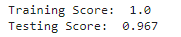
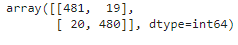

# Advertising_Classification
This project for classifying if the user will click on the ad or not by using classification in supervised machine learning.
## Used Libraries:
- Pandas
- Matplotlib
- Seaborn
- Sklearn
- Warnings
## Training and Testing Scores

## Confusion Matrix

